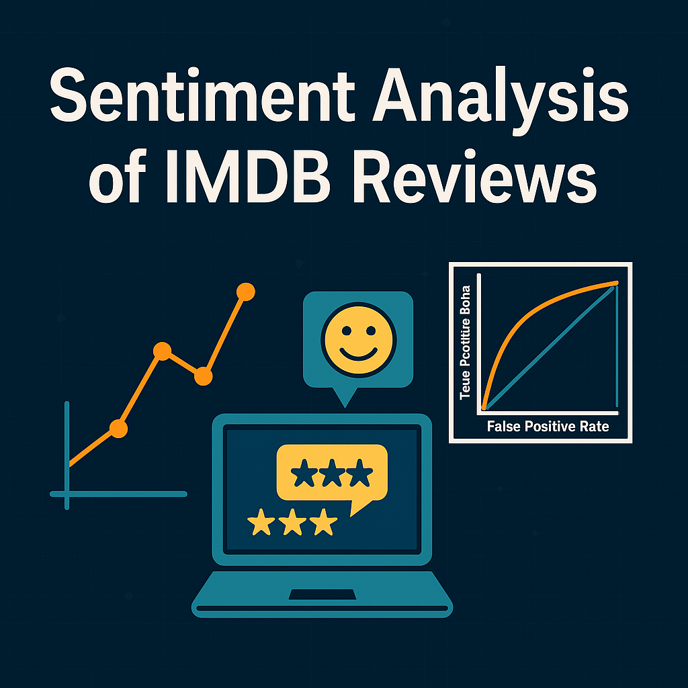
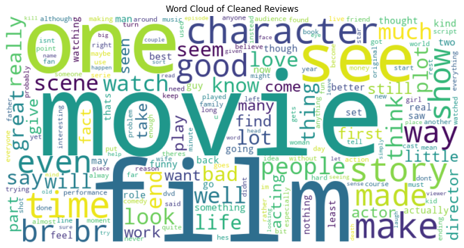
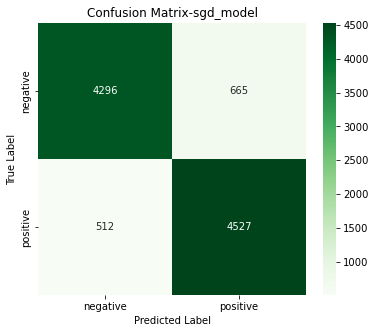
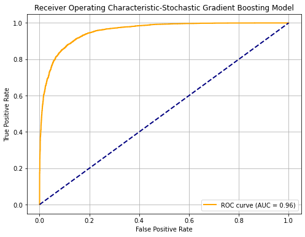
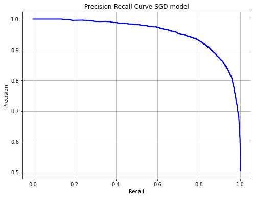

#**Sentiment Analyis**

This project builds a sentiment classification model using IMDB movie reviews, cleaned and vectorized into a machine learning pipeline. 
The model was trained using Stochastic Gradient Descent (SGD) with log_loss and Logistic Regression evaluated on test data.

	

---
#**🧠Model Overview**

- **Models Used:**
  - `SGDClassifier` with `loss="log_loss"` and `TfidfVectorizer`
  - `LogisticRegression` with `TfidfVectorizer`
- **Text Processing:** Custom `text_cleaning` function (from `text_utils.py`)
- **Vectorization:** TF-IDF with top 5,000 features
- **Train/Test Split:** 80/20

---
#**Word Cloud Visualization of the IMDb Text reviews**

	

---
#**Evaluation Result**
| Metric                      | SGDClassifier        | LogisticRegression    |
|-----------------------------|----------------------|------------------------|
| Cross-Validation Accuracy   | 87.30%               | 88.15%                 |
| Test Accuracy               | 86.25%               | 87.80%                 |

---
#**Classification Report**

	

---
#**Confusion Matrix**

	

---
#ROC Curve

	

---
#Precision Recall Curve

	

---